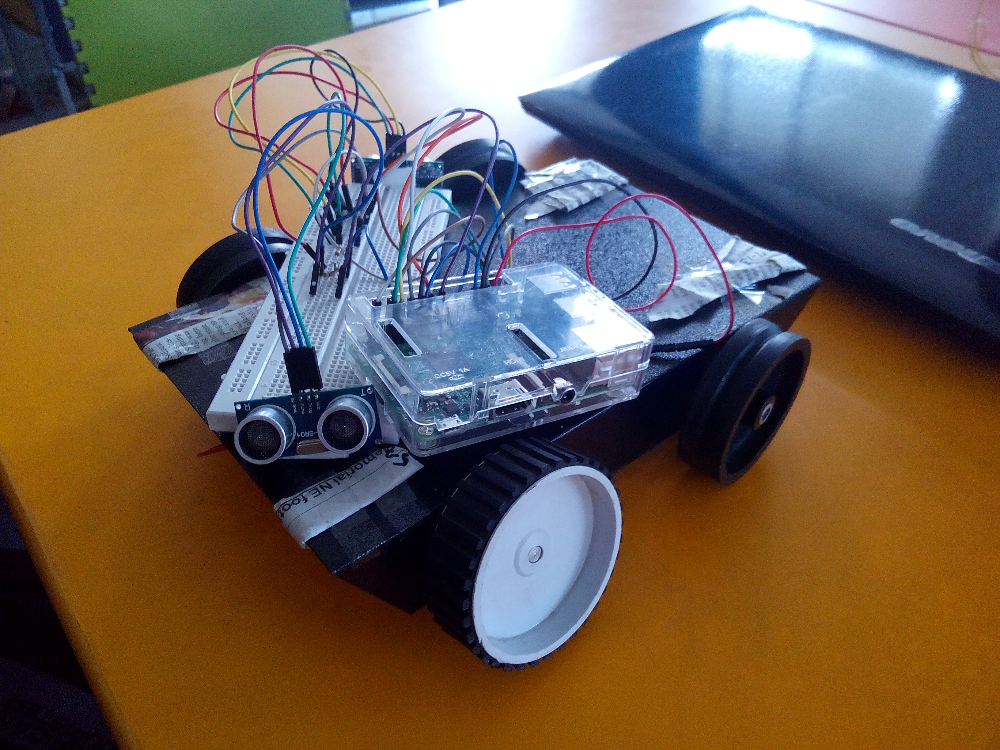

# Obstacle Sensor

obstacle_sensor.py is run on Raspberry Pi (with pins connected as follows) connected to two ultrasonic sensors and four motors. This device can sense obstacles around it using sensors and based on the distance calculated, motors are run accordingly to change direction. 

Pin 5 - left motor A
Pin 7 - left motor B
Pin 11 - right motor A
Pin 13 - right motor B
Pin 16 - output to sensor 1 (TRIG)
Pin 15 - output to sensor 2 (TRIG)
Pin 18 - input from sensor 1 (ECHO)
Pin 22 - input from sensor 2 (ECHO)

